# 안녕하세요, 안드로이드 개발자 원딱입니다! 👋

- 📱 **Android & Multiplatform Developer**로 활동 중입니다.
- 💡 새로운 기술을 탐구하고, 생산성을 높이는 라이브러리를 만드는 것을 즐깁니다.
- 🔗 [**웹 포트폴리오**](https://jmseb3.github.io/portfolio/)에서 상세 이력을 확인하실 수 있습니다.
- 📝 [**Velog 블로그**](https://velog.io/@jmseb3)에서 개발 기록을 공유합니다.

## Open Source Contributions

## 🛠 Tech Stack
 
 
 

---

## 🚀 Projects

| 프로젝트 | 설명 | 개발 연도 | 구분 | 비고 |
|:---:|:---|:---:|:---:|:---|
|    [**Moo!ments**](https://play.google.com/store/apps/details?id=io.project.mooment&hl=en&pli=1) | 소확행 기록 앱 | 2025 | **팀** | Android |
| **Boas** | 보드게임 점수 어플 | 2025 | **개인** | (CMP) |
|    [**LoaCell**](https://play.google.com/store/apps/details?id=com.wonddak.loacell.android&hl=ko-KR) | 로스트아크 파티 관리 어플 | 2023 | **개인** | [Android](https://play.google.com/store/apps/details?id=com.wonddak.loacell.android) / [iOS](https://apps.apple.com/app/id6475280029) 출시 |
|    ~~[**보드게임 매니저**](https://github.com/jmseb3/app_boardgame2)~~ | 보드게임 점수판 및 유틸리티 | 2021 | **개인** | 2025: CMP 신규 기획 중 |
|    [**코인 평단 계산기**](https://github.com/jmseb3/app_coin) | 코인/주식 계산 및 실시간 시세 | 2021 | **개인** | 2023: Compose 마이그레이션 |
|    [**MT 매니저**](https://github.com/jmseb3/app_mt_manager) | 여행 계획 플래너 | 2021 | **개인** | 2024: CMP 마이그레이션 완료 |
|    [**시원한 수학박사**](https://github.com/jmseb3/app_watermelon) | 고등학생 수학공부 어플 | 2021 | **개인** | - |

---

## 📦 Libraries (KMP / Compose)

| 라이브러리 | 설명 | 플랫폼 |
|:---:|:---|:---:|
| [**MTK**](https://github.com/jmseb3/MTK) | Kotlin Multiplatform Korean currency formatter | All (KMP) |
| [**KMP-Vibrate**](https://github.com/jmseb3/Kmp-Vibrate) | Kotlin Multiplatform vibrate library | AOS/iOS/JS/Wasm |
| [**Hellogin**](https://github.com/jmseb3/helLogin) | Compose Multiplatform Auth library | AOS/iOS |
| [**Capturable**](https://github.com/jmseb3/Capturable) | Compose Multiplatform UI capture library | All (KMP) |
| [**SwitchView-Compose**](https://github.com/jmseb3/SwitchView-Compose) | Compose Custom Switch component | AOS/iOS |
| [**SimpleJWTParser**](https://github.com/jmseb3/KMM-Simple-JWT-Parser) | Kotlin Multiplatform JWT payload parser | AOS/iOS |
| [**SwiftUI-SnackBar**](https://github.com/jmseb3/SwiftUI-Snackbar) | Snackbar implementation for SwiftUI | iOS |
| [**SwipeBack**](https://github.com/jmseb3/swipeBack) | Swipe-back action for SwiftUI | iOS |

---

## 🔌 Plugins

| 플러그인 | 설명 | 플랫폼 |
|:---:|:---|:---:|
| [**Font Helper**](https://github.com/jmseb3/Android_Font_Helper_Plugin) | Android Compose 폰트 코드 생성을 돕는 플러그인 | Android Studio |
