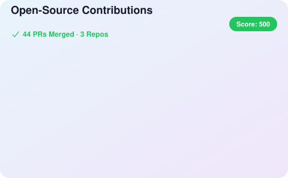

# 안녕하세요, 안드로이드 개발자 원딱입니다 👋

Android를 중심으로, **Kotlin Multiplatform / Compose Multiplatform**까지 확장하며  
실사용 앱과 생산성 라이브러리를 만들고 있는 개발자입니다.

- 📱 **Android & Multiplatform Developer**
- ⚙️ 반복 작업은 줄이고, 더 나은 개발 경험을 만드는 데 관심이 많습니다.
- 🧩 작지만 분명한 가치를 주는 앱과 라이브러리를 꾸준히 만들고 있습니다.
- 🔗 [포트폴리오](https://jmseb3.github.io/portfolio/)
- 📝 [Velog](https://velog.io/@jmseb3)

---

## Open Source Contributions

---

## 🛠 Tech Stack

---

## 🚀 Projects

| 프로젝트 | 설명 | 연도 | 형태 | 비고 |
|:---|:---|:---:|:---:|:---|
|  [**얼마고 (AllMaGo)**](https://play.google.com/store/apps/details?id=com.wonddak.allmago.androidApp) | 복잡한 **N빵 계산 / 모임 정산**을 쉽게 정리하는 앱 | 2026 | 개인 | [Android](https://play.google.com/store/apps/details?id=com.wonddak.allmago.androidApp) / [iOS](https://apps.apple.com/kr/app/%EC%96%BC%EB%A7%88%EA%B3%A0/id6761168767) 출시 |
|  [**Moo!ments**](https://play.google.com/store/apps/details?id=io.project.mooment&hl=en&pli=1) | 소확행 기록 앱 | 2025 | 팀 | Android |
| [**Boas**](https://play.google.com/store/apps/details?id=com.wonddak.boas.androidApp&hl=ko) | 간단한 점수판과 타이머를 활용한 보드게임 점수 기록 앱 | 2025 | 개인 | Android 출시 |
|  [**LoaCell**](https://play.google.com/store/apps/details?id=com.wonddak.loacell.android&hl=ko-KR) | 로스트아크 파티 / 레이드 관리 앱 | 2023 | 개인 | [Android](https://play.google.com/store/apps/details?id=com.wonddak.loacell.android) / [iOS](https://apps.apple.com/app/id6475280029) 출시 |
|  ~~[**보드게임 매니저**](https://github.com/jmseb3/app_boardgame2)~~ | 보드게임 점수판 및 유틸리티 앱 | 2021 | 개인 | 2025년부터 CMP 기반 신규 기획 진행 중 |
|  [**코인 평단 계산기**](https://github.com/jmseb3/app_coin) | 코인 / 주식 계산 및 실시간 시세 확인 앱 | 2021 | 개인 | 2023: Compose 마이그레이션 |
|  [**MT 매니저**](https://github.com/jmseb3/app_mt_manager) | 여행 / 모임 계획을 위한 총무용 앱 | 2021 | 개인 | 2024: CMP 마이그레이션 완료 |
|  [**시원한 수학박사**](https://github.com/jmseb3/app_watermelon) | 고등학생 대상 수학 학습 앱 | 2021 | 개인 | - |

---

## 📦 Libraries

| 라이브러리 | 설명 | 플랫폼 |
|:---|:---|:---:|
| [**MTK**](https://github.com/jmseb3/MTK) | Kotlin Multiplatform 한국 통화 포맷 라이브러리 | All (KMP) |
| [**KMP-Vibrate**](https://github.com/jmseb3/Kmp-Vibrate) | Kotlin Multiplatform 진동 라이브러리 | Android / iOS / JS / Wasm |
| [**Hellogin**](https://github.com/jmseb3/helLogin) | Compose Multiplatform 인증 라이브러리 | Android / iOS |
| [**Capturable**](https://github.com/jmseb3/Capturable) | Compose Multiplatform UI 캡처 라이브러리 | All (KMP) |
| [**SwitchView-Compose**](https://github.com/jmseb3/SwitchView-Compose) | Compose 커스텀 스위치 컴포넌트 | Android / iOS |
| [**SimpleJWTParser**](https://github.com/jmseb3/KMM-Simple-JWT-Parser) | Kotlin Multiplatform JWT Payload Parser | Android / iOS |
| [**SwiftUI-SnackBar**](https://github.com/jmseb3/SwiftUI-Snackbar) | SwiftUI용 Snackbar 구현 | iOS |
| [**SwipeBack**](https://github.com/jmseb3/swipeBack) | SwiftUI Swipe Back Action | iOS |

---

## 🔌 Plugins

| 플러그인 | 설명 | 플랫폼 |
|:---|:---|:---:|
| [**Font Helper**](https://github.com/jmseb3/Android_Font_Helper_Plugin) | Android Compose 폰트 코드 생성을 돕는 플러그인 | Android Studio |

---

## Interested In

- Android Architecture
- Kotlin Multiplatform / Compose Multiplatform
- Developer Productivity
- Reusable UI / Utility Libraries
- Small but useful product ideas

---

## Contact & Links

- 🌐 [Portfolio](https://jmseb3.github.io/portfolio/)
- 📝 [Velog](https://velog.io/@jmseb3)
- 🐙 [GitHub](https://github.com/jmseb3)
